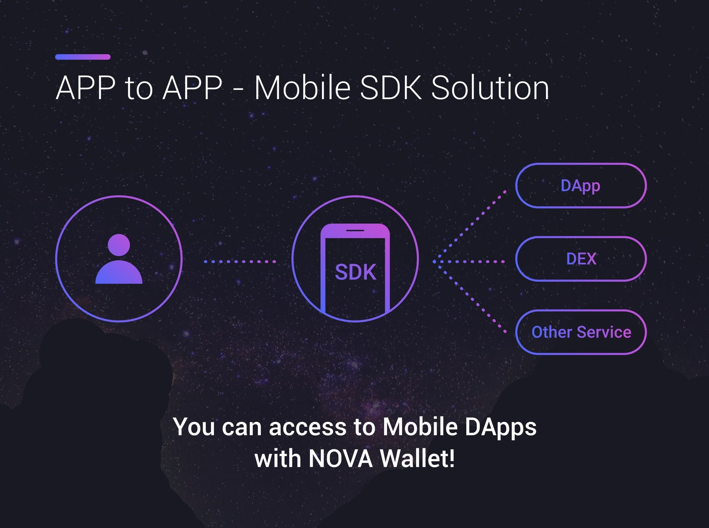
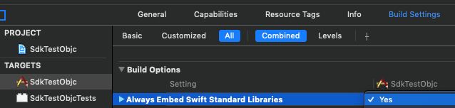

# Requirements
- [NOVA 1.4.0][1]
- iOS 10.0

* SUPPORT SWIFT5

#### For more information please see [the website][2].

# Installation

## CocoaPods


## Carthage


## Swift Package Manager


## Manually

# Usage

## info.pList file,

### add this,

```xml
<key>LSApplicationQueriesSchemes</key>
<array>
<string>eosnova</string>
</array>
```

### add this,

```xml
<key>CFBundleURLTypes</key>
<array>
<dict>
<key>CFBundleTypeRole</key>
<string>Editor</string>
<key>CFBundleURLSchemes</key>
<array>
<string>{scheme}</string>
</array>
</dict>
</array>
```

{scheme} must be replaced <b>eosnova.packagename</b><br/>
ex) when packagename is <b>com.wzdworks.Nova</b>, {scheme} will be replaced <b>eosnova.com.wzdworks.Nova</b>


## In AppDelegate,

### Swift
```swift

import NovaAuth  //import this

class AppDelegate: UIResponder, UIApplicationDelegate {

func application(_ application: UIApplication, didFinishLaunchingWithOptions launchOptions: [UIApplication.LaunchOptionsKey: Any]?) -> Bool {

....
NovaAuth.shared.register(dappName: "YOUR APP NAME. IT WILL SHOW NOVA SDK AUTH")
....

return ....
}

func application(_ app: UIApplication, open url: URL, options: [UIApplication.OpenURLOptionsKey : Any] = [:]) -> Bool {

....
NovaAuth.shared.openURL(url: url)
....

return ....
}

func applicationDidBecomeActive(_ application: UIApplication) {

....
NovaAuth.shared.applicationDidBecomeActive()
....

}
}
```

### Objective-C (AppDelegate.m)
```objective-c
#import "NovaAuth/NovaAuth-Swift.h" //import this

@implementation AppDelegate

- (BOOL)application:(UIApplication *)application didFinishLaunchingWithOptions:(NSDictionary *)launchOptions {
    ....
    [NovaAuth.shared registerWithDappName: @"YOUR APP NAME. IT WILL SHOW NOVA SDK AUTH"];
    ....

    return ......
}

- (BOOL)application:(UIApplication *)app openURL:(NSURL *)url options:(NSDictionary<UIApplicationOpenURLOptionsKey,id> *)options {
    ....
    [NovaAuth.shared openURLWithUrl:url];
    ....

    return ......
}

- (void)applicationDidBecomeActive:(UIApplication *)application {
    ....
    [NovaAuth.shared applicationDidBecomeActive];
    ....
}

@end


```

#### in Objc Project, Set YES, Build Settings -> Always Embed Swift Standard Libraries


## Connect to Testnet

before request, add this.

### Swift
```swift
NovaAuth.shared.setTestMode()   //will connect default testnet address
NovaAuth.shared.setTestMode(address: "http://you.want.to.connect.to")
```

### Objective-C
```Objective-c
[NovaAuth.shared setTestModeWithAddress: @""];  //will connect default testnet address
[NovaAuth.shared setTestModeWithAddress: @"http://you.want.to.connect.to"];
```

This will be applied globally.

## Request

### Read Account Info
#### Swift
```swift
// read account info (/v1/chain/get_account)
// account will be choosed in nova
// 'raw' contains account information
NovaAuth.shared.requestAccount { result in
let code = result.code
let msg = result.msg
let raw = result.raw
}
```

#### Objective-C
```Objective-c
[NovaAuth.shared requestAccountWithCallback:^(NovaAuthResult * _Nonnull callback) {
    long code = callback.code;
    NSString* msg = callback.msg;
    NSString* raw = callback.raw;
}];
```

### Transfer token
#### Swift
```swift        
// from : Account name format. not be empty
// to : Account name format. not be empty
// contract : Token contract format. not be empty
// symbol : Token symbol uppercased. not be empty
// amount : send amount. > 0
// precision : >= 0
// memo : can be empty
NovaAuth.shared.requestTransfer(from: "test2eosnova", to: "wzdworksnova", contract: "eosio.token", symbol: "EOS", amount: 1990.0509, precision: 4, memo: "memo here") { result in
let code = result.code
let msg = result.msg
let raw = result.raw
} 
```

#### Objective-C
```Objective-c
[NovaAuth.shared requestTransferFrom:@"test2eosnova" to:@"wzdworksnova" contract:@"eosio.token" symbol:@"EOS" amount:1990.0509 precision:4 memo:@"memo here" callback:^(NovaAuthResult * _Nonnull callback) {
    long code = callback.code;
    NSString* msg = callback.msg;
    NSString* raw = callback.raw;
}];
```

### Stake / Unstake
#### Swift
```swift        
// stake
// account : Account name format. not be empty
// cpu : Eos token format. >= 0
// net : Eos token format. >= 0
// * cpu, net both 0 will make error
NovaAuth.shared.requestStake(account: "test2eosnova", to: "wzdworksnova", cpu: 0.5959, net: 0.5959, transfer: true) { result in
let code = result.code
let msg = result.msg
let raw = result.raw
}


// unstake
// account : Account name format. not be empty
// cpu : Eos token format. >= 0
// net : Eos token format. >= 0
// * cpu, net both 0 will make error
NovaAuth.shared.requestUnstake(account: "test2eosnova", to: "wzdworksnova", cpu: 0.5959, net: 0.5959) { result in
let code = result.code
let msg = result.msg
let raw = result.raw
}
```

#### Objective-C
```Objective-c
//stake
[NovaAuth.shared requestStakeWithAccount:@"test2eosnova" to:@"wzdworksnova" cpu:0.5959 net:0.5959 transfer:YES callback:^(NovaAuthResult * _Nonnull callback) {
    long code = callback.code;
    NSString* msg = callback.msg;
    NSString* raw = callback.raw;
}];

//unstake
[NovaAuth.shared requestUnstakeWithAccount:@"test2eosnova" to:@"wzdworksnova" cpu:0.5959 net:0.5959 callback:^(NovaAuthResult * _Nonnull callback) {
    long code = callback.code;
    NSString* msg = callback.msg;
    NSString* raw = callback.raw;
}];

```

### Make signed string
#### Swift
```swift        
// account : Account name format. not be empty
// message : Key-Value Dictionary. at least include 1 key.
// 'raw' contains signed dictionary


var msg = Dictionary<String, String>()
msg["key1"] = "This message"
msg["key2"] = "will"
msg["key3"] = "be signed"

NovaAuth.shared.requestSignature(account: "test2eosnova", messages: msg) { result in
let code = result.code
let msg = result.msg
let raw = result.raw
}
```

#### Objective-C
```Objective-c
NSDictionary *msg = [NSDictionary dictionaryWithObjectsAndKeys:@"This message", @"key1", @"will", @"key2", @"be signed", @"key3", nil];
    
[NovaAuth.shared requestSignatureWithAccount:@"test2eosnova" messages:msg callback:^(NovaAuthResult * _Nonnull callback) {
    long code = callback.code;
    NSString* msg = callback.msg;
    NSString* raw = callback.raw;
}];
```

### Push a your custom action
#### Swift
```swift        
// push a your custom action.

// make your action
var args = Dictionary<String,Any>()
args["payer"] = "test2eosnova"
args["receiver"] = "wzdworksnova"
args["bytes"] = 4096
let action = NovaAction(code: "eosio", action: "buyrambytes", args: args)

// push action
// account : Account name format. not be empty.
NovaAuth.shared.requestCustomTransaction(account: "test2eosnova", action: action) { result in
let code = result.code
let msg = result.msg
let raw = result.raw
}
```

#### Objective-C
```Objective-c
NSDictionary *args = @{@"payer": @"test2eosnova",
                        @"receiver": @"wzdworksnova",
                        @"bytes": [NSNumber numberWithInt:4096]
                        };
    
NovaAction *action = [[NovaAction alloc] initWithCode:@"eosio" action:@"buyrambytes" args:args];
    
[NovaAuth.shared requestCustomTransactionWithAccount:@"test2eosnova" action:action callback:^(NovaAuthResult * _Nonnull callback) {
    long code = callback.code;
    NSString* msg = callback.msg;
    NSString* raw = callback.raw;
}];
```

### Push your custom actions
#### Swift
```swift        
// push your custom actions

let from = "test2eosnova"
let to = "actiontest11"
let ram = 5959
let cpu = 0.59
let net = 0.59
let ownerPublicKey = "key"
let activePublicKey = "key"

var ownerKey = Dictionary<String,Any>()
ownerKey["key"] = ownerPublicKey
ownerKey["weight"] = 1

var ownerInfo = Dictionary<String,Any>()
ownerInfo["threshold"] = 1
ownerInfo["keys"] = [ownerKey]
ownerInfo["waits"] = Array<Any>()
ownerInfo["accounts"] = Array<Any>()

var activeKey = Dictionary<String,Any>()
activeKey["key"] = activePublicKey
activeKey["weight"] = 1

var activeInfo = Dictionary<String,Any>()
activeInfo["threshold"] = 1
activeInfo["keys"] = [activeKey]
activeInfo["waits"] = Array<Any>()
activeInfo["accounts"] = Array<Any>()

var args = Dictionary<String,Any>()
args["creator"] = from
args["name"] = to
args["owner"] = ownerInfo
args["active"] = activeInfo

let action1 = NovaAction(code: "eosio", action: "newaccount", args: args)

///////////////////////////////////////////////////////////////////////////////
var args2 = Dictionary<String,Any>()
args2["payer"] = from
args2["receiver"] = to
args2["bytes"] = ram

let action2 = NovaAction(code: "eosio", action: "buyrambytes", args: args2)

///////////////////////////////////////////////////////////////////////////////
var args3 = Dictionary<String,Any>()
args3["from"] = from
args3["receiver"] = to
args3["stake_cpu_quantity"] = String(format: "%.4f EOS", cpu)
args3["stake_net_quantity"] = String(format: "%.4f EOS", net)
args3["transfer"] = true

let action3 = NovaAction(code: "eosio", action: "delegatebw", args: args3)

NovaAuth.shared.requestCustomTransaction(account: from, actions: [action1, action2, action3]) { result in
let code = result.code
let msg = result.msg
let raw = result.raw
}
```

#### Objective-C
```Objective-c
NSString *from = @"test2eosnova";
NSString *to = @"actiontest11";
int ram = 5959;
double cpu = 0.59;
double net = 0.59;
NSString *ownerPublicKey = @"key";
NSString *activePublicKey = @"key";

NSDictionary *ownerKey = @{@"key": ownerPublicKey,
                            @"weight": [NSNumber numberWithInt:1]
                            };

NSDictionary *ownerInfo = @{@"threshold": [NSNumber numberWithInt:1],
                            @"keys": [[NSArray alloc] initWithObjects:ownerKey, nil],
                            @"waits": [[NSMutableArray alloc] init],
                            @"accounts": [[NSMutableArray alloc] init]
                            };

NSDictionary *activeKey = @{@"key": activePublicKey,
                            @"weight": [NSNumber numberWithInt:1]
                            };

NSDictionary *activeInfo = @{@"threshold": [NSNumber numberWithInt:1],
                                @"keys": [[NSArray alloc] initWithObjects:activeKey, nil],
                                @"waits": [[NSMutableArray alloc] init],
                                @"accounts": [[NSMutableArray alloc] init]
                                };

NSDictionary *args = @{@"creator": from,
                        @"name": to,
                        @"owner": ownerInfo,
                        @"active": activeInfo
                        };

NovaAction *action1 = [[NovaAction alloc] initWithCode:@"eosio" action:@"newaccount" args:args];

///////////////////////////////////////////////////////////////////////////////
NSDictionary *args2 = @{@"payer": from,
                        @"receiver": to,
                        @"bytes": [NSNumber numberWithInt:ram]
                        };

NovaAction *action2 = [[NovaAction alloc] initWithCode:@"eosio" action:@"buyrambytes" args:args2];

///////////////////////////////////////////////////////////////////////////////
NSDictionary *args3 = @{@"from": from,
                        @"receiver": to,
                        @"stake_cpu_quantity": [NSString stringWithFormat:@"%.4f EOS", cpu],
                        @"stake_net_quantity": [NSString stringWithFormat:@"%.4f EOS", net],
                        @"transfer": @YES
                        };

NovaAction *action3 = [[NovaAction alloc] initWithCode:@"eosio" action:@"delegatebw" args:args3];

NSArray *actions = [[NSArray alloc] initWithObjects: action1, action2, action3, nil];

[NovaAuth.shared requestCustomTransactionWithAccount:from actions:actions callback:^(NovaAuthResult * _Nonnull callback) {
    long code = callback.code;
    NSString* msg = callback.msg;
    NSString* raw = callback.raw;
}];
```

### Result (NovaAuthResult)

```swift
class NovaAuthResult {
var code:Int
var msg:String
var raw:String                  //has response raw value from eos network or other information.
}

```  
#### Response code
0:"success"
100:"user cancel",              //User pressed 'cancel' button
101:"wrong arguments",          //Parameter of your request is wrong
200:"No account in Nova",       //Account list empty in nova.
201:"No account in Nova",       //Can't find account in nova.
300:"transaction fail",         //Fail to push transaction. because of bad network or other reason.

500:"can't receive response",   //User back to dapp without any action
501:"wrong response"            // not use yet.

# License 

Copyright 2018 WizardWorks Inc. All rights reserved.

Licensed under the Apache License, Version 2.0 (the "License");
you may not use this file except in compliance with the License.
You may obtain a copy of the License at

http://www.apache.org/licenses/LICENSE-2.0

Unless required by applicable law or agreed to in writing, software
distributed under the License is distributed on an "AS IS" BASIS,
WITHOUT WARRANTIES OR CONDITIONS OF ANY KIND, either express or implied.
See the License for the specific language governing permissions and
limitations under the License.

[1]: https://apple.co/2NZZrUj
[2]: http://eosnova.io
